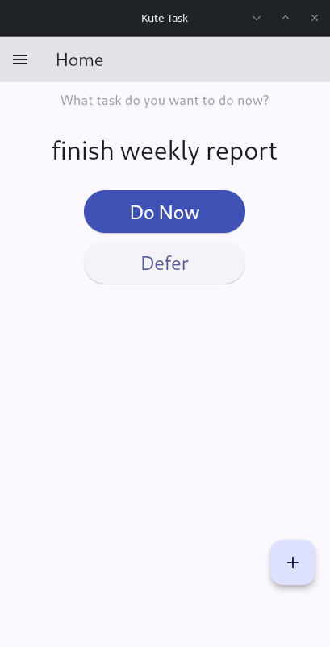
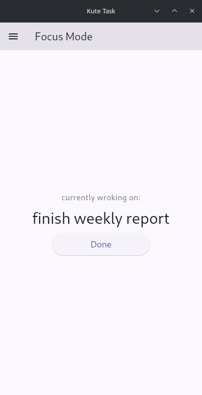
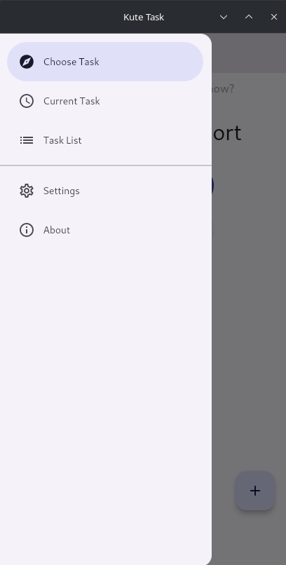

## Kute Task App

### One Task at a Time
Kute Task is not just another task tracking app. It has its own twist: showing only **one task at a time**, not a long list of tasks.

---
### 💡 The Idea
Most, if not all, task tracking apps show you a list of all your tasks being tracked which may be distracting.
Some users, myself included, get easily distracted if they're shown a list of **multiple** things to do. It makes it hard to pick one task to do while focusing only on that task.

In addition, some task tracking apps are bloated with features like: categorizing, tagging, prioritizing, sharing and/or taking notes related to the task. All of that takes away from the basic idea of helping the user remember the list of tasks that need to be done.

Hence the idea of Kute Task App. It shows you one (and only one) task at a time. You're given the choice to do that one task, or "defer" it to another time.
If you choose to defer the task, it get pushed to bottom of the list and you get shown the next task with the two above options: **do now** or **defer**. If you defer again, you get the next **one** and so on.

However, if instead you choose to do the task, the app removes all distraction and shows you only the task you're currently working on, with a button to click when you finish the task.

It's that simple. No distraction, no extra features.

### 🎞️ Screenshots

### 🎯 Target Users
The ideal user if Kute Task is anyone who wants a simple task tracking app that minimizes distraction and show only one task at a time, not a long list of tasks.

### 🗄️ Tech Stack
The app is written completely in Python. The UI is a [Flet](https://flet.dev/) app built on top of a simple API layer that interacts with a SQLite DB through [SQLModel](https://sqlmodel.tiangolo.com/).

- 💾 [SQLite DB](https://sqlite.org/)
- 🔌 [SQLModel](https://sqlmodel.tiangolo.com/)
- 🐍 Python API
- 📱 [Flet](https://flet.dev/)

### 🖥️ Supported Platroms
There are currently Linux and Android versions (found in [Realeses](releases/)).

Windows, MacOS, iOS versions comming soon.